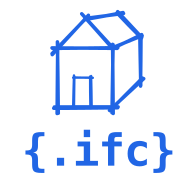

<p align="center">
  
</p>

# IFC Language Support for VS Code

[](https://marketplace.visualstudio.com/items?itemName=wolfnepomuk.vscode-ifc)
[](https://open-vsx.org/extension/wolfnepomuk/vscode-ifc)
[](LICENSE)

IFC Language Tools adds language support for IFC STEP files (`.ifc`, `.step`, `.stp`) in Visual Studio Code. It is powered by the [IFC Language Server](https://github.com/NepomukWolf/IFC-Language-Server).

For normal use, install the extension and open an IFC file. The extension automatically installs the language server version pinned by the current extension release.

## Documentation

Full user documentation is available at:

<https://NepomukWolf.github.io/vscode-ifc/>

Install from:

- [Visual Studio Code Marketplace](https://marketplace.visualstudio.com/items?itemName=wolfnepomuk.vscode-ifc)
- [Open VSX](https://open-vsx.org/extension/wolfnepomuk/vscode-ifc)
- [GitHub Releases](https://github.com/NepomukWolf/vscode-ifc/releases) for manual `.vsix` installation

## Features


IFC Language Tools combines local editor support with language-server features for:

- Reading IFC files: syntax highlighting, bracket matching, semantic highlighting, hover previews, entity documentation, and derived-value hover.
- Navigation: go to definition, find references, document highlights, document symbols, Outline, breadcrumbs, and go-to-symbol.
- Validation: schema-aware diagnostics for IFC entity and attribute issues.
- Editing assistance: signature help, inlay hints, and IFC file scaffold generation.
- 3D preview: focused element preview without loading the whole model in a separate viewer.
- Large files: lightweight features remain available where possible while expensive AST-backed analysis is bounded.

Detailed feature docs:

- [Hover](https://NepomukWolf.github.io/vscode-ifc/features/hover)
- [Navigation](https://NepomukWolf.github.io/vscode-ifc/features/navigation)
- [Document Symbols](https://NepomukWolf.github.io/vscode-ifc/features/document-symbols)
- [Editing Assistance](https://NepomukWolf.github.io/vscode-ifc/features/editing-assistance)
- [Inlay Hints](https://NepomukWolf.github.io/vscode-ifc/features/inlay-hints)
- [Diagnostics](https://NepomukWolf.github.io/vscode-ifc/features/diagnostics)
- [3D Preview](https://NepomukWolf.github.io/vscode-ifc/features/three-d-preview)
- [Large Files](https://NepomukWolf.github.io/vscode-ifc/features/large-files)

## Getting Started

1. Install the extension from the Marketplace, Open VSX, or a release `.vsix`.
2. Open an IFC file (`.ifc`, `.step`, or `.stp`) in Visual Studio Code.
3. Use hover, navigation, diagnostics, Outline, and 3D preview directly in the editor.

See the [Getting Started guide](https://NepomukWolf.github.io/vscode-ifc/getting-started) for detailed installation steps.

## Configuration

Most users do not need to change settings. The extension manages the language server automatically.

Advanced settings are documented here:

- [Configuration](https://NepomukWolf.github.io/vscode-ifc/configuration)
- [Troubleshooting](https://NepomukWolf.github.io/vscode-ifc/troubleshooting)

If the language server fails to start after setting a custom server path, clear `ifc.server.path` and run `IFC: Restart Language Server`.

## Commands

- `IFC: Download Language Server`
- `IFC: Restart Language Server`
- `IFC: Show Resolved Language Server`
- `IFC: Preview Element in 3D`

## Development

Install dependencies and compile the extension:

```bash
npm install
npm run compile
```

Then open `src/extension.ts`, press `F5`, and choose `VS Code Extension Development Host`.

Package a local `.vsix` with:

```bash
npm run package
```

If you are developing the language server itself, point the extension at a local build with `ifc.server.path`. Leave this setting empty for normal use.

## Language Server

This extension is powered by the [IFC Language Server](https://github.com/NepomukWolf/IFC-Language-Server).

For normal use, the extension automatically installs the language server version pinned by the current extension release. For release packaging, the extension expects platform-specific language-server assets whose names include operating-system and architecture hints such as `macos-arm64`, `linux-x64`, or `windows-x64`.

## License

This project is licensed under the **MIT License**. See [LICENSE](LICENSE) for details.
